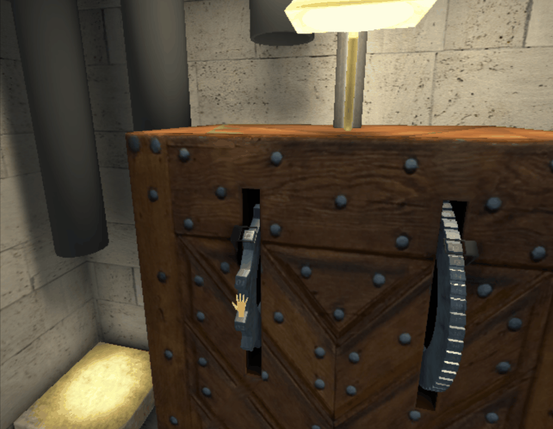

# gvrDemo 0.4.1 beta
Google Daydream demo app using Unity 5.4

This is a simple Daydream app created to showcase the technical skills necessary for producing an interactive VR world.

The latest stable Android version can be found in the [build](https://github.com/jdknox/vrDemo/tree/master/build) folder.  Development is ongoing in the [`develop`](https://github.com/jdknox/vrDemo/tree/develop) branch.

# Motivation
The future of Virtual Reality looks bright, and this project was started with the intent to build a VR game from scratch.  The main goal is to create a demo from the ground up to determine the challenges and potential solutions that arise in this relatively new medium.  One of the goals of this particular project is to find intuitive ways for the player to interact with the environment through a virtual hand.  These interactions include grabbing/interacting with objects (see Fig's. 1 and 2), rotating objects around an axis that is perpendicular to the player's forward direction (see Fig. 3), and rotation around a parallel axis (like a safe dial; work in progress).
###### Figure 1. Opening a door

###### Figure 2. Grabbing an object

###### Figure 3. Rotation about perpendicular axis

In addition, problems typical to any programming project--and in particular a computer game--are sure to crop up.  So, creating this demo also serves as a study into producing a game from start to finish, including appropriate user feedback, optimization and debugging.

# Running the demo
Either a Google Daydream Controller or a second Android phone to act as the controller emulator is required as described [here](https://developers.google.com/vr/concepts/controller-emulator).
The in-game controls are as follows:
* Touchpad area (large circle): character movement
* Touchpad double tap (click emulation): interact
* App button: interact

# Future improvements
Optimization is always ongoing, targeting 60 FPS.  More interactions are in the works, as well as general polishing and cleanup.  Also, the code is in more of a prototyping stage; better use of OO principles would make it easier to extend and maintain.

# About me
I have a Bachelor's degree in Physics, as well as formal training in Computer Science and Technical 3D Animation.  I enjoy the debugging process to quickly diagnose problem areas, and have strong analytical skills.  Mathematics is a common thread throughout all my interests and education, which has resulted in a strong affinity for math, especially how it relates to real world problems like 3D graphics and physical applications.  Locating and solving problems is a passion of mine, and I enjoy prototyping an idea, and then analyzing the results to look for places where I can improve the efficiency.  Creating this VR demo game combines all of my passions and I hope you will enjoy the final product as much as I have enjoyed creating it.
